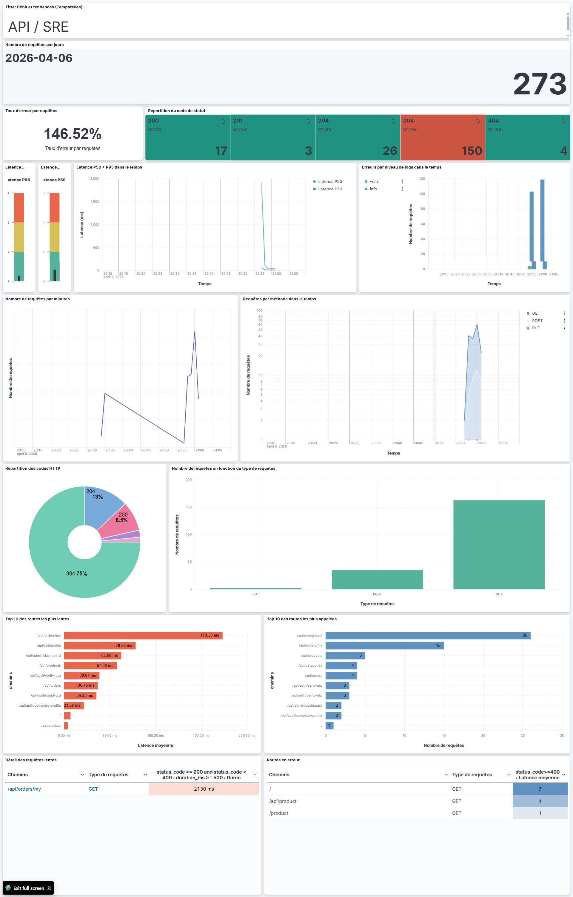
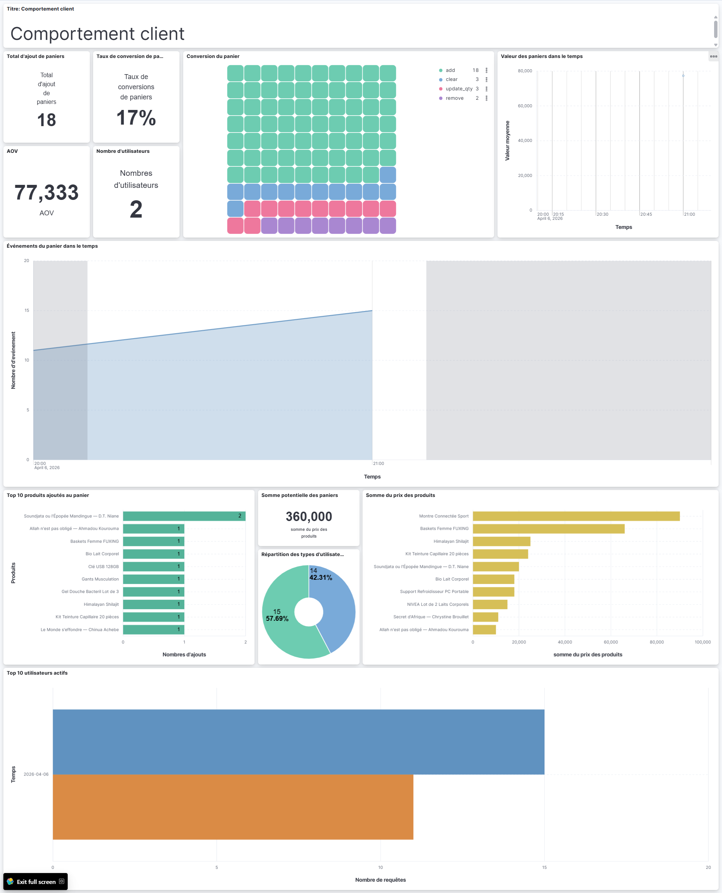
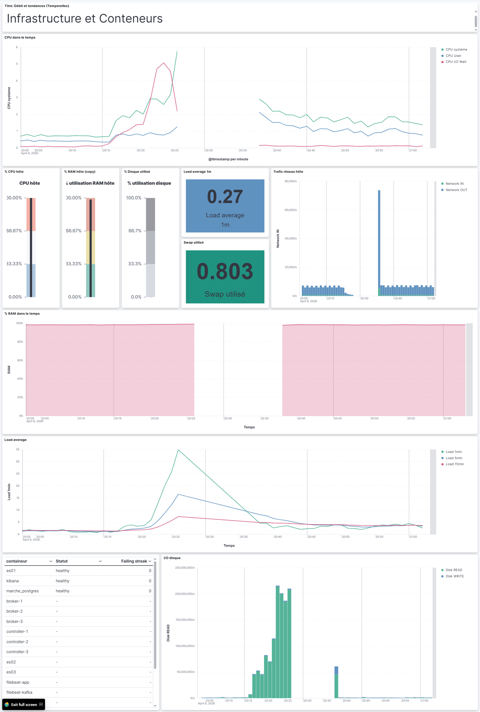

# Visualisations - APP

> Filtre global à appliquer sur tous les panels : `source_pipeline: "backend"`

---

## Dashboard 1 - API / SRE

> Filtre : `log_type: "http_request"`

---

### KPIs (Metric)

| Card | Graphique | Champs | Fonction |
|------|-----------|--------|----------|
| Requêtes totales | **Metric** | `@timestamp` | Count |
| Répartition par requêtes | **Metric** | `status_code` | Count |
| Taux d'erreur | **Metric** | Formula | `count(kql='status_code >= 400') / count() * 100` |
| Latence P95 | **Jauge** | `duration_ms` | Percentile 95 |
| Latence P50 | **Jauge** | `duration_ms` | Percentile 50 |

---

### Débit et tendances (séries temporelles)

| Card | Graphique | Axe X | Axe Y | Segmentation |
|------|-----------|-------|-------|--------------|
| Requêtes par minute | **Line chart** | `@timestamp` (histogram 1m) | Count | - |
| Latence P50 + P95 dans le temps | **Line chart** (2 lignes) | `@timestamp` (histogram 1m) | Percentile 50 · Percentile 95 sur `duration_ms` | - |
| Erreurs par niveau dans le temps | **Bar chart stacked** | `@timestamp` (histogram 5m) | Count | `log_level.keyword` (info / warn / error) |
| Requêtes par méthode dans le temps | **Area chart stacked** | `@timestamp` (histogram 5m) | Count | `method.keyword` |

---

### Distribution des routes et codes

| Card | Graphique | Champs | Fonction |
|------|-----------|--------|----------|
| Codes HTTP | **Donut chart** | `status_code` | Terms · top 8 |
| Méthodes HTTP | **Vertical bar** | `method.keyword` | Terms |
| Top 10 routes les plus appelées | **Horizontal bar** | `path.keyword` | Terms · top 10 · Count |
| Top 10 routes les plus lentes | **Horizontal bar** | `path.keyword` | Terms · top 10 · Average `duration_ms` |
| Distribution latence | **Histogram** | `duration_ms` | Histogram · interval 50ms |

###
exclude
{
  "bool": {
    "must_not": [
      {
        "regexp": {
          "path.keyword": ".*\\.(png|jpg|jpeg|gif|webp|svg|ico|bmp|tiff|avif|woff|woff2|ttf|eot|css|js)(\\?.*)?"
        }
      },
      {
        "prefix": {
          "path.keyword": "/images/"
        }
      }
    ]
  }
}
###
---

### Tableau de détail

| Card | Graphique | Colonnes | Tri |
|------|-----------|----------|-----|
| Routes en erreur | **Data table** | `path.keyword` · `method.keyword` · Count · avg `duration_ms` | Count DESC · filtre `status_code >= 400` |
| Requêtes lentes détail | **Data table** | `path.keyword` · `method.keyword` · max `duration_ms` · avg `duration_ms` | max `duration_ms` DESC · filtre `duration_ms > 500` |

---

## Dashboard 2 - Comportement client (Cart Events)

> Filtre : `log_type: "cart_event"`

---

### KPIs (Metric)

| Card | Graphique | Champs | Fonction |
|------|-----------|--------|----------|
| Total add_to_cart | **Legacy Metrics** | `cart.event.keyword` | Count · filtre `cart.event: "add"` |
| Taux de conversion | **Legacy Metric** | Formula | `count(kql='cart.event.keyword: "update_qty"')/ count(kql='cart.event.keyword: "add"') * 100` |
| Panier moyen (AOV) | **Legacy Metric** | `cart.subtotal` | Average · filtre `cart.event: "update_qty"` |
| Utilisateurs uniques | **Legacy Metric** | `cart.userId.keyword` | Cardinality |

---

### Entonnoir de conversion

| Card | Graphique | Champs | Fonction |
|------|-----------|--------|----------|
| Funnel add -> view -> checkout | **waffle** | `cart.event.keyword` | Terms · filtré sur `add_to_cart` · `view_cart` · `update_qty` · Count |

---

### Tendances des événements

| Card | Graphique | Axe X | Axe Y | Segmentation |
|------|-----------|-------|-------|--------------|
| Événements panier dans le temps | **Area chart stacked** | `@timestamp` (histogram 1h) | Count | `cart.event.keyword` |
| Checkouts dans le temps | **Line chart** | `@timestamp` (histogram 1h) | Count · filtre `cart.event: "checkout"` | - |
| Valeur des paniers dans le temps | **Line chart** | `@timestamp` (histogram 1h) | Average `cart.subtotal` · filtre `cart.event: "update_qty"` | - |

---

### Produits

| Card | Graphique | Champs | Fonction |
|------|-----------|--------|----------|
| Top 10 produits ajoutés au panier | **Horizontal bar** | `cart.product.name.keyword` | Terms · top 10 · Count · filtre `cart.event: "add_to_cart"` |
| Revenus potentiels par produit | **Horizontal bar** | `cart.product.name.keyword` | Terms · top 10 · Sum `cart.product.price` |

---

### Utilisateurs

| Card | Graphique | Champs | Fonction |
|------|-----------|--------|----------|
| Anonymes vs identifiés | **Donut chart** | `cart.userId.keyword` | Terms · 2 buckets : valeur `"anonyme"` vs reste |
| Top utilisateurs actifs | **Horizontal bar** | `cart.userId.keyword` | Terms · top 10 · Count · exclure `"anonyme"` |
| Quantité moyenne par article | **Metric** | `cart.items.qty` | Average |

# Visualisations - Infrastructure (`metrics-elk-*`)

> Pas de filtre global - les champs `system.*` et `docker.*` discriminent naturellement les deux modules.

---

## Dashboard - Infrastructure & Conteneurs

---

### KPIs hôte (Metric - dernière valeur)

| Card | Graphique | Champs | Fonction |
|------|-----------|--------|----------|
| CPU hôte | **Gauge** (0–100%) | `system.cpu.total.pct` | Last value |
| RAM hôte | **Gauge** (0–100%) | `system.memory.used.pct` | Last value |
| Load average 1m | **Metric** | `system.load.norm.1` | Last value |
| Swap utilisé | **Metric** | `system.memory.swap.used.pct` | Last value |
| Disque utilisé | **Gauge** (0–100%) | `system.filesystem.used.pct` | Last value · filtre `system.filesystem.mount_point: "/"` |

---

### Séries temporelles hôte

| Card | Graphique | Axe X | Axe Y | Segmentation |
|------|-----------|-------|-------|--------------|
| CPU dans le temps | **Line chart** (multi) | `@timestamp` (histogram 1m) | Average `system.cpu.total.pct` · `system.cpu.user.pct` · `system.cpu.iowait.pct` | - |
| RAM dans le temps | **Area chart** | `@timestamp` (histogram 1m) | Average `system.memory.used.pct` | - |
| Load average | **Line chart** (3 lignes) | `@timestamp` (histogram 1m) | Average `system.load.1` · `system.load.5` · `system.load.15` | - |
| Trafic réseau hôte | **BAR VERTICAL STACKED** (in/out) | `@timestamp` (histogram 1m) | Counter rate `system.network.in.bytes` · Counter rate `system.network.out.bytes` | - |
| I/O disque | **BAR VERTICAL STACKED** (read/write) | `@timestamp` (histogram 1m) | Counter rate `system.diskio.read.bytes` · Counter rate `system.diskio.write.bytes` | - |

---

### Conteneurs Docker

| Card | Graphique | Champs | Fonction |
|------|-----------|--------|----------|
| État de santé | **Data table** | `docker.container.name.keyword` · `docker.healthcheck.status` · `docker.healthcheck.failingstreak` | Terms · Last value |