# Plateforme d'Observabilité et d'Analyse Comportementale

Plateforme de streaming de données et d'observabilité temps réel construite sur la stack **Kafka + ELK**. Elle collecte, transporte, transforme et visualise les logs d'une application e-commerce pour produire trois axes d'analyse : comportement client, performance API/SRE et monitoring infrastructure.

---

## Apercu de l'application source

L'application e-commerce sert de générateur de données réelles. Elle expose un catalogue produits, un panier, un tunnel de commande et une interface d'administration. Chaque interaction utilisateur produit des logs structurés qui alimentent la pipeline.


---

## Architecture globale

### Vue d'ensemble de la pipeline

```
                        APPLICATION
           ┌--------------------------------┐
           │  Frontend (React)              │
           │  Backend  (Express / Node.js)  │
           │  Base de données (PostgreSQL)  │
           └------------┬-------------------┘
                        │ logs Docker
                    Filebeat
                        │
                        ▼
              ┌-----------------┐
              │  Apache Kafka   │  <--  buffer de streaming
              │  3 brokers      │       découplage producteur/consommateur
              │  3 controllers  │       rétention 7 jours
              └--------┬--------┘
                       │ consommation par pipeline
                   Logstash
                  (3 pipelines)
                       │ indexation
                       ▼
             ┌------------------┐
             │ Elasticsearch    │  <--  cluster 3 nœuds, TLS, réplication
             │  es01/es02/es03  │
             └--------┬---------┘
                      │
                   Kibana
              (dashboards temps réel)
```

### Monitoring infrastructure (chemin direct)

Metricbeat envoie directement vers Elasticsearch, sans passer par Kafka, pour éviter toute dépendance circulaire.

```
  Metricbeat  ------------------------------>  Elasticsearch
  (hôte + conteneurs Docker)                  index: metrics-elk-*
```

Les logs des brokers Kafka sont eux aussi collectés par un Filebeat dédié et envoyés directement vers Elasticsearch.

```
  Filebeat-kafka  -------------------------->  Elasticsearch
  (logs brokers)                               index: logs-kafka-*
```

### Emplacement du schema d'architecture logique

> Le schema d'architecture logique detaille (flux reseau, ports, networks Docker, interactions entre services) sera insere ici.

---

## Stack technique

| Couche | Technologie | Role |
|---|---|---|
| Application | React 19, Express.js, PostgreSQL 15 | Source de données |
| Collecte | Filebeat 8.11 | Lecture des logs Docker, routage vers Kafka |
| Streaming | Apache Kafka 3 (KRaft) | Buffer, découplage, rétention |
| Traitement | Logstash 8.11 | Parsing Grok, enrichissement, indexation |
| Stockage | Elasticsearch 8.11 (cluster 3 nœuds) | Moteur de recherche et d'agrégation |
| Visualisation | Kibana 8.11 | Dashboards, alertes mail |
| Monitoring infra | Metricbeat 8.11 | CPU, RAM, réseau, conteneurs Docker |
| Orchestration | Docker Compose + Makefile | Démarrage et arrêt des composants |

---

## Pipeline de données en détail

### Collecte - Filebeat

Filebeat lit les logs des conteneurs Docker via le socket Docker. Il filtre uniquement les conteneurs applicatifs (`marche_backend`, `marche_frontend`, `marche_postgres`) et route chaque flux vers le topic Kafka correspondant.

| Conteneur | Topic Kafka |
|---|---|
| `marche_backend` | `backend-logs` |
| `marche_frontend` | `frontend-logs` |
| `marche_postgres` | `postgres-logs` |

### Streaming - Apache Kafka (KRaft)

Le cluster Kafka tourne en mode **KRaft** (sans Zookeeper). Les 3 controllers gèrent les métadonnées et l'élection des leaders via le protocole Raft. Les 3 brokers stockent les messages avec une réplication factor de 3 et un `min.insync.replicas` de 2.

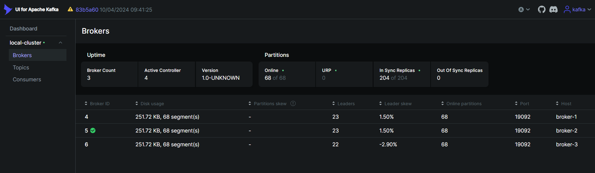
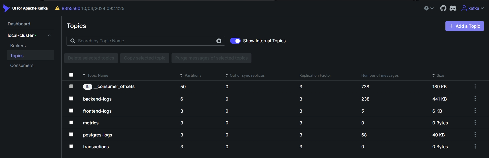
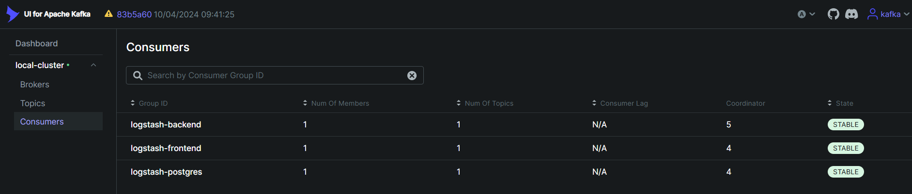

Les topics actifs et leur configuration :

| Topic | Partitions | Réplication | Usage |
|---|---|---|---|
| `backend-logs` | 6 | 3 | Logs HTTP + événements panier |
| `frontend-logs` | 3 | 3 | Logs React/Vite |
| `postgres-logs` | 3 | 3 | Requêtes lentes, erreurs SQL |
| `transactions` | 3 | 3 | Réservé |
| `metrics` | 3 | 3 | Réservé |

Les messages du topic `backend-logs` tels qu'ils transitent dans Kafka :

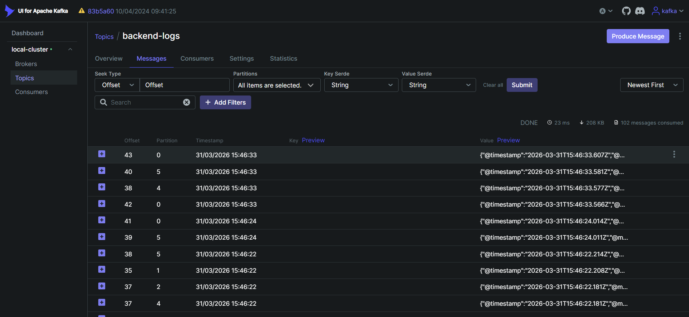
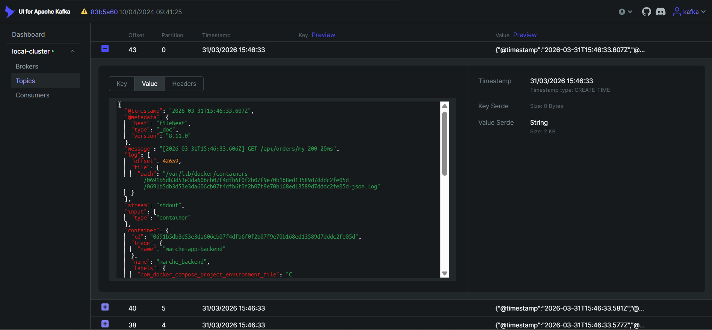

### Traitement - Logstash (3 pipelines indépendantes)

Chaque pipeline tourne avec 2 workers indépendants. Le pipeline `backend` detecte automatiquement le format des messages :

- **`http_request`** : `[timestamp] METHOD /path STATUS DURATIONms` - requêtes HTTP avec latence et code retour
- **`cart_event`** : `[CART] {...json...}` - événements panier structurés (add, view_cart, checkout, update_qty)

Le pipeline `postgres` détecte en plus les requêtes lentes (`slow_query`), les deadlocks et les échecs d'authentification via des tags Grok.

| Pipeline | Topic consommé | Index Elasticsearch |
|---|---|---|
| backend | `backend-logs` | `logstash-backend-YYYY.MM.DD` |
| frontend | `frontend-logs` | `logstash-frontend-YYYY.MM.DD` |
| postgres | `postgres-logs` | `logstash-postgres-YYYY.MM.DD` |

### Stockage - Elasticsearch (cluster 3 nœuds)

Le cluster garantit la haute disponibilité par réplication des shards sur les 3 nœuds. Toutes les communications sont chiffrées via TLS (certificats générés au premier démarrage).

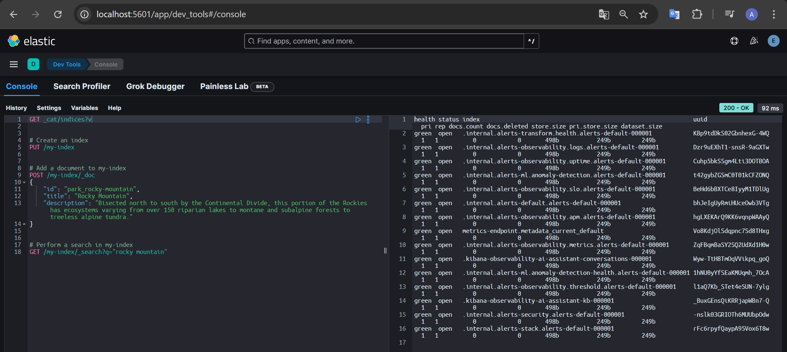
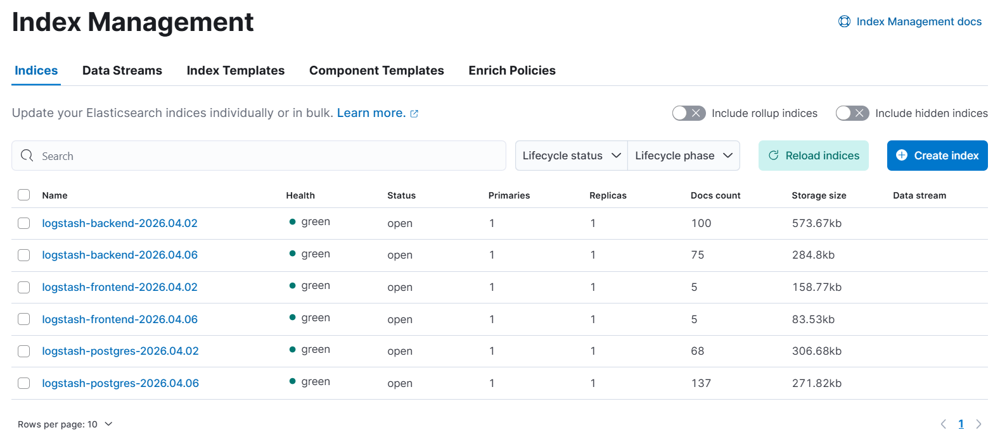
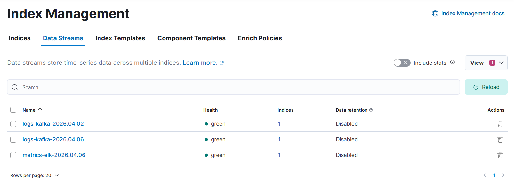

Les logs indexés sont immédiatement interrogeables dans Kibana Discover :

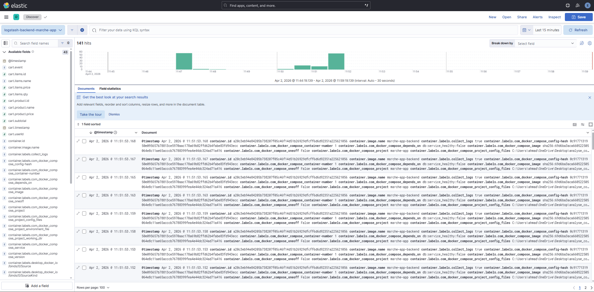
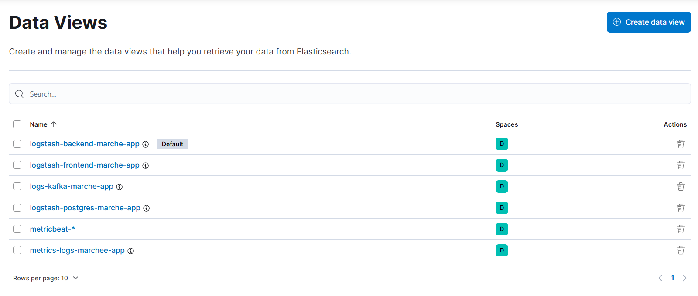

---

## Dashboards Kibana

Trois dashboards temps réel construits dans Kibana. La description exhaustive de chaque visualisation (champs, fonctions d'agrégation, filtres KQL) est disponible dans [MONITORING.md](MONITORING.md).

---

### Dashboard 1 - API / SRE

**Index source :** `logstash-backend-*` - filtre `log_type: "http_request"`

Analyse des performances de l'API en temps réel. Permet de détecter immédiatement les dégradations de latence, les pics d'erreurs et les routes problématiques.

**Visualisations :**
- KPIs : requêtes totales, taux d'erreur (formula Kibana), latence P50 et P95 (jauge)
- Séries temporelles : débit par minute, évolution latence P50/P95, erreurs par niveau (info/warn/error), répartition par méthode HTTP
- Distribution : codes HTTP (donut), top 10 routes les plus appelées, top 10 routes les plus lentes, histogramme de latence
- Tableaux de détail : routes en erreur, requêtes lentes (> 500ms)


---

### Dashboard 2 - Comportement Client

**Index source :** `logstash-backend-*` - filtre `log_type: "cart_event"`

Analyse du parcours utilisateur sur l'application e-commerce. Chaque interaction avec le panier (ajout, consultation, checkout) produit un événement JSON structuré qui alimente ce dashboard.

**Visualisations :**
- KPIs : total add_to_cart, taux de conversion (add -> checkout), panier moyen (AOV), utilisateurs uniques (cardinality)
- Entonnoir : funnel add -> view_cart -> update_qty (waffle chart)
- Tendances : événements panier dans le temps, checkouts, évolution de la valeur des paniers
- Produits : top 10 produits ajoutés au panier, revenus potentiels par produit
- Utilisateurs : anonymes vs identifiés, top utilisateurs actifs, quantité moyenne par article


---

### Dashboard 3 - Infrastructure et Conteneurs

**Index source :** `metrics-elk-*` - alimenté directement par Metricbeat (hors pipeline Kafka)

Monitoring de la machine hôte et de tous les conteneurs Docker. Permet de corréler une dégradation applicative avec une saturation de ressource.

**Visualisations :**
- KPIs hôte : CPU, RAM, load average 1m, swap, disque (jauges temps réel)
- Séries temporelles : CPU multi-courbes (total/user/iowait), RAM, load average 1/5/15m, trafic réseau in/out, I/O disque read/write
- Conteneurs Docker : tableau d'état de santé avec `healthcheck.status` et `failingstreak` pour chaque conteneur


---

## Scalabilité et déploiement multi-infra

### Architecture actuelle - mono-machine

Tous les composants tournent sur une seule machine via Docker Compose. C'est la configuration de développement et de démonstration.

### Déploiement distribué sur 2 ou 3 serveurs

Chaque composant étant conteneurisé et communiquant via des networks nommés, le système se prête naturellement à une distribution sur plusieurs VPS ou serveurs physiques :

```
  Serveur 1 (App + Filebeat)
  ├-- marche_frontend
  ├-- marche_backend
  ├-- marche_postgres
  └-- filebeat-app  -->  Serveur 2 (Kafka)

  Serveur 2 (Kafka)
  ├-- controller-1/2/3
  ├-- broker-1/2/3
  └-- filebeat-kafka  -->  Serveur 3 (ELK)

  Serveur 3 (ELK + Monitoring)
  ├-- es01 / es02 / es03
  ├-- logstash
  ├-- kibana
  └-- metricbeat
```

Il suffit de modifier les adresses des brokers Kafka et des nœuds Elasticsearch dans les fichiers de configuration pour pointer vers les bons hôtes.

### Monitoring de chaque serveur avec Metricbeat

Metricbeat peut être déployé indépendamment sur **n'importe quel VPS ou serveur** de l'infrastructure. Il collecte les métriques système (CPU, RAM, disque, réseau) et les métriques Docker des conteneurs qui tournent sur cet hôte, et les envoie directement vers le cluster Elasticsearch central.

```
  VPS 1  --  metricbeat  -->
  VPS 2  --  metricbeat  -->  Elasticsearch (central)
  VPS 3  --  metricbeat  -->
```

Un seul cluster Elasticsearch centralise ainsi l'observabilité de toute l'infrastructure.

### Passage à Kubernetes

Pour un déploiement Kubernetes, chaque composant devient un `Deployment` ou `StatefulSet` :

- **Kafka** : `StatefulSet` (3 brokers, volumes persistants par pod via `volumeClaimTemplates`)
- **Elasticsearch** : `StatefulSet` (3 nœuds, stockage persistant, ECK - Elastic Cloud on Kubernetes - est l'opérateur officiel recommandé)
- **Logstash / Kibana** : `Deployment` classique
- **Filebeat / Metricbeat** : `DaemonSet` (un pod par nœud du cluster, accès au socket Docker)

Kubernetes apporte le scaling horizontal automatique (HPA sur Logstash selon la charge CPU), la gestion des secrets (credentials Elasticsearch), les probes de santé et le rolling update sans interruption.

### Prochain déploiement - AWS

Le prochain step est le déploiement de l'architecture sur AWS :

| Composant | Service AWS envisagé |
|---|---|
| Kafka | Amazon MSK (Managed Streaming for Kafka) |
| Elasticsearch | Amazon OpenSearch Service ou EC2 + cluster auto-géré |
| Stockage logs | Amazon S3 (archivage long terme depuis Logstash) |
| Conteneurs | Amazon ECS (Fargate) ou EKS (Kubernetes managé) |
| Réseau | VPC, Security Groups, ALB |

---

## Conteneurs en fonctionnement

Vue complète des conteneurs actifs sur la machine de développement :

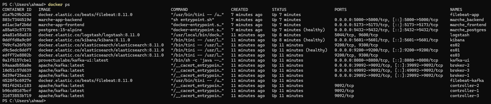

---

## Installation

### Prérequis

**Docker**

Version utilisée lors du développement : Docker Engine **26.x** (API version 1.54).

```bash
docker --version   # Docker version 26.x.x
docker compose version
```

**Make**

Le Makefile orchestre le démarrage de chaque composant dans le bon ordre.

```bash
# Windows (Chocolatey)
choco install make

# Windows (Scoop)
scoop install make

# Linux (Debian/Ubuntu)
sudo apt install make

# macOS
brew install make
```

**Fichier `.env`**

Un fichier `.env` global est placé à la racine du projet. Il est la source de vérité pour tous les services. Les valeurs par défaut fonctionnent sans modification.

| Variable | Valeur par défaut |
|---|---|
| `ELASTIC_PASSWORD` | `passer` |
| `KIBANA_PASSWORD` | `passer` |
| `KAFKA_UI_USER` | `kafka` |
| `KAFKA_UI_PASSWORD` | `kafka` |
| `STACK_VERSION` | `8.11.0` |

---

### Etape 1 - Créer les networks Docker

Tous les networks sont **externes** (partagés entre les Docker Compose). Ils doivent être créés manuellement avant le premier démarrage. Le network de l'application (`marche-network`) est le seul créé automatiquement par son Docker Compose.

```bash
docker network create kafka-net
docker network create elk-net
```

---

### Etape 2 - Démarrer le système

#### Option A - Tout lancer d'un coup (recommandé)

```bash
make up-all
```

Le Makefile démarre les composants dans le bon ordre avec des délais d'attente entre chaque étape :
1. Kafka (controllers + brokers + init topics)
2. Attente 60 secondes
3. ELK (setup + Elasticsearch + Logstash + Kibana)
4. Attente 60 secondes
5. Application (frontend + backend + db + filebeat)
6. Attente 60 secondes
7. Metricbeat

#### Option B - Composant par composant

```bash
make up-kafka          # Cluster Kafka
make up-elk            # Stack ELK complète
make up-app            # Application + Filebeat
make up-metricbeat     # Monitoring infrastructure
```

Il est aussi possible de démarrer les composants ELK séparément :

```bash
make up-elk-es         # Elasticsearch uniquement
make up-elk-logstash   # Logstash uniquement
make up-elk-kibana     # Kibana uniquement
```

---

### Etape 3 - Initialiser la base de données (premier lancement)

```bash
docker exec marche_backend npx prisma migrate deploy
docker exec marche_backend npx prisma db seed
```

---

### Etape 4 - Accès aux interfaces

| Interface | URL | Utilisateur | Mot de passe |
|---|---|---|---|
| Application | http://localhost:5173 | - | - |
| API / Swagger | http://localhost:5000/api-docs | - | - |
| Kibana | http://localhost:5601 | `elastic` | `passer` |
| Elasticsearch | https://localhost:9200 | `elastic` | `passer` |
| Kafka UI | http://localhost:8080 | `kafka` | `kafka` |

Compte admin de l'application : indicatif `+221`, téléphone `810000000`, OTP `123456`.

---

### Arrêter le système

```bash
make down-all          # Tout arrêter
make down-app          # Application uniquement
make down-kafka        # Kafka uniquement
make down-elk          # ELK uniquement
make down-metricbeat   # Metricbeat uniquement
```

---

## Augmenter les ressources allouées

Les ressources (RAM, CPU) allouées à chaque service se configurent directement dans les fichiers `docker-compose.yml` correspondants via la clé `deploy.resources` ou les variables d'environnement Java.

### Elasticsearch - Heap JVM

Dans `elk-compose/docker-compose.yml`, modifier la variable d'environnement de chaque nœud :

```yaml
environment:
  - "ES_JAVA_OPTS=-Xms512m -Xmx512m"   # valeur actuelle : 256m
```

La règle générale : allouer **50% de la RAM disponible** au heap, sans dépasser 30-32 GB.

### Logstash - Heap JVM

Dans `elk-compose/docker-compose.yml` :

```yaml
environment:
  - LS_JAVA_OPTS=-Xms1g -Xmx1g   # valeur actuelle : 512m
```

Augmenter aussi le nombre de workers dans `elk-compose/config/pipelines.yml` :

```yaml
- pipeline.id: backend
  pipeline.workers: 4   # valeur actuelle : 2
```

### Kafka - Limites conteneurs

Dans `kafka/docker-compose.yml`, ajouter une section `deploy` sur chaque broker :

```yaml
broker-1:
  deploy:
    resources:
      limits:
        memory: 2g
      reservations:
        memory: 1g
```

---

## Structure du projet

```
.
├-- .env                        # Variables d'environnement globales
├-- Makefile                    # Orchestration du démarrage
├-- marche-app/                 # Application e-commerce (source de logs)
│   ├-- backend/                # API Express.js + Prisma
│   ├-- frontend/               # SPA React + Vite
│   ├-- filebeat.yml            # Config Filebeat -> Kafka
│   └-- docker-compose.yml      # App + Filebeat
├-- kafka/                      # Cluster Kafka KRaft
│   ├-- docker-compose.yml      # 3 controllers + 3 brokers + UI
│   └-- filebeat.yml            # Logs brokers -> Elasticsearch
├-- elk-compose/                # Stack ELK
│   ├-- docker-compose.yml      # ES (3 nœuds) + Logstash + Kibana
│   ├-- config/                 # logstash.yml + pipelines.yml
│   └-- pipeline/               # backend.conf, frontend.conf, postgres.conf
├-- metricbeat/                 # Monitoring infrastructure
│   ├-- docker-compose.yml
│   └-- metricbeat.yml          # Modules system + docker
└-- images/                     # Captures d'écran du projet
```
